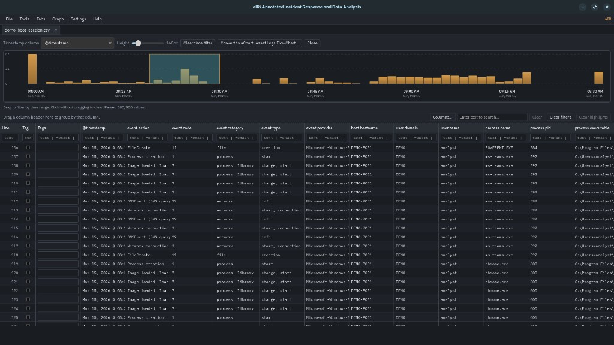
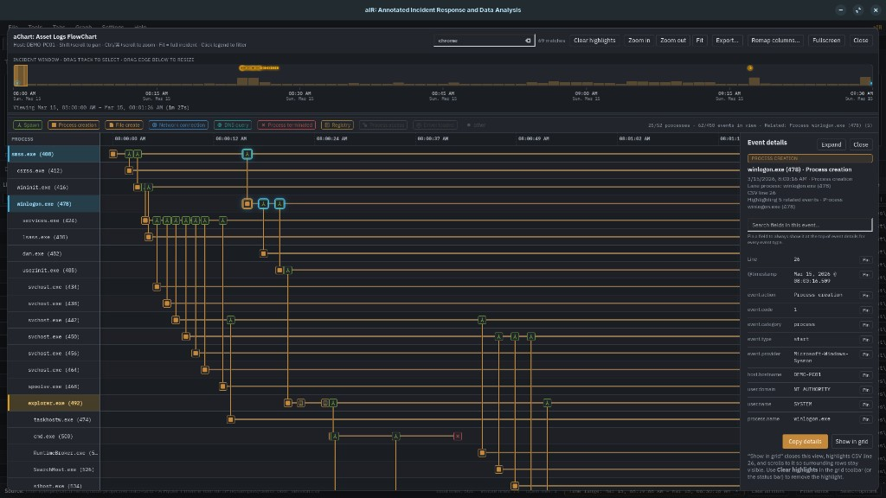
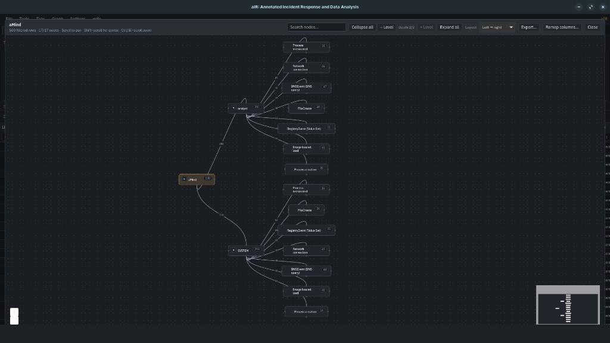
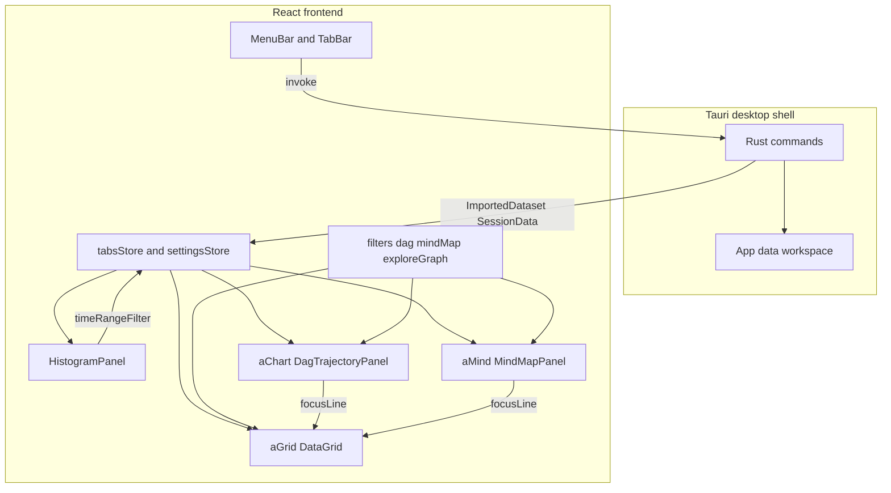
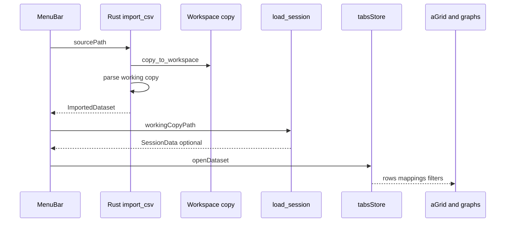
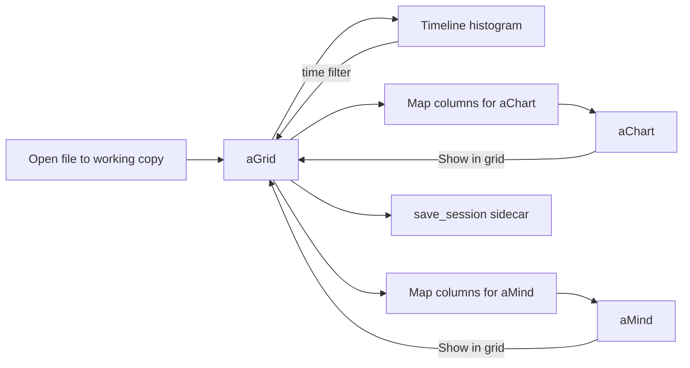

# aIR: Annotated Incident Response and Data Analysis

Cross-platform DFIR triage toolkit. **Tauri 2 + React + TypeScript**. Windows, macOS, Linux.

**Download:** [Releases](https://github.com/strootle002/aIR/releases) (Windows + Linux installers)

Import tabular logs. Filter and annotate in a spreadsheet. Explore with charts and mindmaps. Original evidence files stay untouched.

## Background

I have been looking for an alternative to [Eric Zimmerman’s Timeline Explorer](https://ericzimmerman.github.io/) for a while. It has many of the features I needed, but was missing many of the things I wanted. Horizontal scroll? Word wrap? Diagramming?

This application is meant to solve those basic problems, while remaining a true timeline tool for DFIR. It builds on the things I liked about Timeline Explorer from Eric Zimmerman, and extends it out to a more full fledged analysis tool. This can help visualize your timelines, give you statistics and breakdowns, and filter however you desire.

**aIR** (*Annotated Incident Response and Data Analysis*) keeps originals read-only (you work on a local copy). **aGrid** is the spreadsheet. **aChart** is process/asset flowcharts. **aMind** is pivot mindmaps. Session sidecars (`.ag_sess`) keep tags, mappings, and layout.

Not a SIEM. Not a full forensics suite. A triage layer for tabular timelines you already exported.

## Screenshots

<p align="center">
  
</p>

*aGrid. Spreadsheet + brushed time filter on the histogram.*

<p align="center">
  
</p>

*aChart. Lifelines, spawn links, glyphs, event inspector.*

<p align="center">
  
</p>

*aMind. Column-pivot mindmap over filtered rows (user → event action).*

## Product names

| Name | Role |
|------|------|
| **aIR** | App (*Annotated Incident Response and Data Analysis*) |
| **aGrid** | Artifact Grid. Spreadsheet / timeline viewer |
| **aChart** | Asset Logs FlowChart. Process / asset swimlane |
| **aMind** | Pivot mindmap (ordered columns → tree) |

## Architecture

**Tauri 2** desktop shell. **Rust** = file I/O (import, export, session). **React + TypeScript** = UI state and viz.

### Component overview



### Import and data flow



### Exploration flow



**Notes**

- Evidence is **copied** to `<data-dir>/artifactgrid/imports/<uuid>/`. Original never opened for write.
- **aGrid** + **aMind** use the *filtered* row set. **aChart** uses the full tab so one event select does not collapse the tree.
- Graphs jump back to aGrid via `focusLine` (scroll + highlight).
- Session state (tags, highlights, mappings, layout) lives in `{workingCopy}.ag_sess`, not in the CSV.

## Features

### aGrid
- Import **CSV / TSV / TXT / JSON / NDJSON** (working copy only)
- Virtualized grid: **Line → Tag → Tags → data**
- Per-column filters (contains / include / exclude), global search, **Filter Editor** (AND / OR / NOT)
- Column sort (timestamp-aware when it applies)
- Display timezone for timestamps (display only; CSV unchanged)
- Conditional formatting; row / column / cell highlights and tags
- Group by headers (expand/collapse, sort by count)
- Show/hide, reorder, resize, word wrap
- Export **visible** or **highlighted** rows (CSV / JSON)
- Session sidecars (`.ag_sess`)

### Graphs
- **Timeline histogram**: brush a time range (**Graph → Graph Timeline…**)
- **aChart**: lifelines, spawn links, glyphs, scrubber, inspector (**Graph → Convert to aChart…**)
- **aMind**: ordered columns → mindmap on filtered rows; expand/collapse levels (**Graph → Convert to aMind…**)
- **Export…**: current view or whole graph as **PNG** / **PDF** (aChart full PDF can be multi-page)

### Other
- Light/dark + accent themes (**Settings**)
- Graph → aGrid jump with row highlight

## Prerequisites

- [Node.js](https://nodejs.org/) 20+
- [Rust](https://rustup.rs/) (stable)
- Tauri platform deps: [prerequisites](https://tauri.app/start/prerequisites/)

## Develop

```bash
npm install
npm run tauri dev
```

## Build

```bash
npm run tauri build
```

Bundles land in `src-tauri/target/release/bundle/` for the OS you build on (e.g. `.deb` / AppImage on Linux). Windows `.exe` needs Windows or CI.

### GitHub Release (Windows + Linux)

Published builds: [github.com/strootle002/aIR/releases](https://github.com/strootle002/aIR/releases)

Workflow: [`.github/workflows/release.yml`](.github/workflows/release.yml)

| Platform | Artifacts |
|----------|-----------|
| Windows | NSIS `.exe`, `.msi` |
| Linux | `.deb`, `.AppImage` |

Tag a version matching `src-tauri/tauri.conf.json` (currently `0.1.0`):

```bash
git tag v0.1.0
git push origin v0.1.0
```

Or **Actions → Release → Run workflow**.  
Repo settings: **Actions → General → Workflow permissions → Read and write**.

## Sample data

[`samples/demo_boot_session.csv`](samples/demo_boot_session.csv): synthetic Sysmon-style boot/login on `DEMO-PC01`.

1. **Graph → Graph Timeline…**
2. **Graph → Convert to aChart…** (auto-suggests process / parent / action columns)
3. **Graph → Convert to aMind…** (e.g. `event.category` → `process.name` → `event.action`)

## Import safety

On open, aIR copies the file here:

```text
<data-dir>/artifactgrid/imports/<uuid>/<filename>
```

Source never opened for write. Never locked by aIR. On-disk folder name `artifactgrid` kept for compatibility.

## License

[MIT](LICENSE). Copyright (c) 2026 ArtifactGrid Contributors
